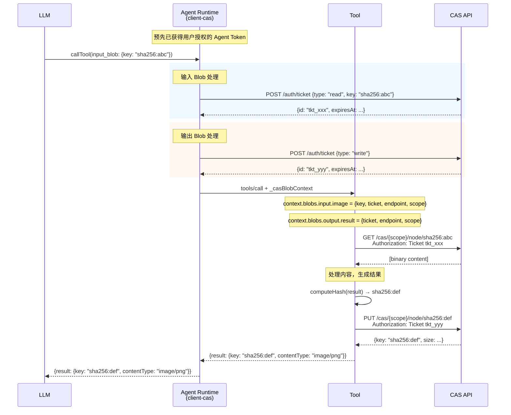

# core-cas 和 client-cas 包开发计划

> 创建 `core-cas` 和 `client-cas` 两个新包，适配 CAS（内容寻址存储）模式。
> 核心变化在于输出 blob 流程：从"预分配槽位-写入"改为"生成内容-计算hash-上传-返回key"，并使用 Ticket 机制进行访问控制。

## 待办事项

- [ ] 创建 packages/core-cas 包结构（package.json, tsconfig.json, index.ts）
- [ ] 定义 CAS 专用类型（CasInputBlobValue, CasOutputBlobValue, CasBlobContext, TicketContext 等）
- [ ] 实现 CAS 版本的 inputBlob() / outputBlob() 函数
- [ ] 实现 CAS 版 ToolRegistry，支持 ticket-based 访问
- [ ] 实现 CAS 版 AgentWebPortalBuilder 和 HttpHandler
- [ ] 创建 packages/client-cas 包结构
- [ ] 实现 CasStorageProvider（基于 CAS API + Ticket）
- [ ] 实现 CasBlobInterceptor（生成 ticket、输入读取、输出上传逻辑）
- [ ] 实现 CAS 版 AwpClient
- [ ] 添加测试用例和更新文档

---

## 认证流程：Ticket 机制

CAS 使用三层认证体系，Agent runtime 通过 ticket 授权 Tool 访问 CAS：

```
OAuth/Cognito → User Token → Agent Token → Ticket
```

**Ticket 类型**：

- `read` ticket：只读访问，需指定 `key`，有效期 1 小时
- `write` ticket：写入访问，有效期 5 分钟

**使用方式**：`Authorization: Ticket ${ticketId}`

---

## 核心设计决策

### 现有流程 vs CAS 流程对比

| 方面 | 现有（S3 Presigned URL） | CAS + Ticket |
|------|--------------------------|--------------|
| **认证方式** | Client 直接生成 presigned URL | Agent Runtime 生成 Ticket，Tool 使用 Ticket |
| **输入读取** | presigned GET URL | read ticket（指定 key，1小时有效） |
| **输出写入** | 预分配 presigned PUT URL | write ticket（5分钟有效），Tool 自行上传 |
| **输出 URI 生成时机** | 调用前（预分配） | 调用后（Tool 上传后返回 key） |
| **权限粒度** | URL 级别 | Ticket 级别（read/write 分离） |

### 输入 Blob 流程

1. LLM 提供 `{ key: "sha256:...", contentType?: string }`
2. Agent runtime（client-cas）生成 **read ticket**（指定 key）
3. 将 ticket + CAS endpoint 传给 Tool
4. Tool 使用 ticket 从 `GET /cas/{scope}/node/{key}` 读取内容

### 输出 Blob 流程

由于 CAS 的 key = hash(content)，**无法预分配 URL**。采用新模式：

1. Agent runtime 生成 **write ticket**
2. 将 ticket + scope + endpoint 传给 Tool
3. Tool 生成内容 → 计算 hash → 使用 ticket 上传到 CAS
4. Tool 返回 `{ key: "sha256:...", contentType: string }`
5. Agent runtime 返回 key 给 LLM

**CAS API 端点**：

- `PUT /cas/{scope}/node/{key}` - 上传（需验证 hash 匹配）
- `GET /cas/{scope}/node/{key}` - 读取

---

## 包结构

### `packages/core-cas/`

```
core-cas/
├── package.json
├── index.ts
└── src/
    ├── types.ts              # CAS 专用类型
    ├── blob.ts               # CAS blob 定义函数
    ├── tool-registry.ts      # 支持 CAS blob 的注册表
    ├── http-handler.ts       # MCP 处理器
    └── agent-web-portal.ts   # Portal 构建器
```

### `packages/client-cas/`

```
client-cas/
├── package.json
├── index.ts
└── src/
    ├── client.ts             # CAS 版 AwpClient
    ├── cas-interceptor.ts    # CAS blob 转换拦截器
    ├── cas-provider.ts       # CAS 存储提供者
    └── types.ts              # 客户端类型
```

---

## 关键类型定义

### LLM-facing 类型（LLM 看到的格式）

```typescript
// 输入 blob 值（LLM 提供）
interface LlmCasInputBlobValue {
  key: string;           // "sha256:..."
  contentType?: string;
}

// 输出 blob 参数（LLM 提供，可选）
interface LlmCasOutputBlobInput {
  accept?: string;       // 期望的 MIME 类型
}

// 输出 blob 结果（LLM 收到）
interface LlmCasOutputBlobResult {
  key: string;           // "sha256:..." (上传后的 CAS key)
  contentType?: string;
}
```

### Tool-facing 类型（Tool 看到的格式）

```typescript
// Ticket 信息
interface TicketInfo {
  id: string;            // ticket ID
  type: "read" | "write";
  expiresAt: string;     // ISO 时间
}

// 输入 blob 值（Tool 接收）
interface ToolCasInputBlobValue {
  key: string;           // CAS key
  ticket: TicketInfo;    // read ticket
  endpoint: string;      // CAS API endpoint
  scope: string;
  contentType?: string;
}

// 输出 blob 上下文（Tool 接收）
interface ToolCasOutputBlobContext {
  ticket: TicketInfo;    // write ticket
  endpoint: string;      // CAS API endpoint
  scope: string;
  accept?: string;
}

// 输出 blob 结果（Tool 返回）
interface ToolCasOutputBlobResult {
  key: string;           // 上传后的 CAS key
  contentType: string;
}

// Tool Handler 接收的完整 context
interface CasBlobHandlerContext {
  blobs: {
    input: Record<string, ToolCasInputBlobValue>;
    output: Record<string, ToolCasOutputBlobContext>;
  };
}
```

### client-cas 类型

```typescript
// CAS 客户端配置
interface CasClientConfig {
  endpoint: string;      // CAS API base URL
  scope: string;         // 用户 scope (如 "usr_{userId}")
  token: string;         // Agent token (用于生成 ticket)
}

// CAS 存储提供者接口
interface CasStorageProvider {
  // 生成 read ticket
  createReadTicket(key: string): Promise<TicketInfo>;
  
  // 生成 write ticket  
  createWriteTicket(): Promise<TicketInfo>;
  
  // 使用 ticket 读取 blob
  getWithTicket(key: string, ticket: TicketInfo): Promise<{ content: Buffer; contentType: string }>;
  
  // 使用 ticket 上传 blob（计算 hash 并上传）
  uploadWithTicket(content: Buffer, contentType: string, ticket: TicketInfo): Promise<string>;
}
```

---

## 实现步骤

### 第一阶段：core-cas 包

1. **创建包结构**
   - `package.json`（依赖 zod）
   - `tsconfig.json`
   - `index.ts`（导出入口）

2. **定义类型**（参考 `packages/core/src/types.ts`）
   - LLM-facing 类型：`LlmCasInputBlobValue`, `LlmCasOutputBlobResult`
   - Tool-facing 类型：`ToolCasInputBlobValue`, `ToolCasOutputBlobContext`, `ToolCasOutputBlobResult`
   - Handler context：`CasBlobHandlerContext`

3. **实现 blob 函数**（参考 `packages/core/src/blob.ts`）
   - `inputBlob(options)` - 创建输入 blob schema
   - `outputBlob(options)` - 创建输出 blob schema
   - 提取和解析函数

4. **实现 ToolRegistry**
   - 注册工具时提取 blob 字段
   - 调用时验证 `_casBlobContext` 存在
   - 将 ticket 信息注入 handler context

5. **实现 HttpHandler 和 Portal Builder**
   - 支持 `_casBlobContext` 参数
   - MCP 协议兼容

### 第二阶段：client-cas 包

1. **创建包结构**
   - `package.json`
   - `tsconfig.json`
   - `index.ts`

2. **实现 CasStorageProvider**（参考 CAS API：`packages/cas-stack/src/router.ts`）
   - `createReadTicket(key)` - 调用 `POST /auth/ticket { type: "read", key }`
   - `createWriteTicket()` - 调用 `POST /auth/ticket { type: "write" }`
   - `getWithTicket(key, ticket)` - 调用 `GET /cas/{scope}/node/{key}`
   - `uploadWithTicket(content, contentType, ticket)` - 计算 hash + 调用 `PUT /cas/{scope}/node/{key}`

3. **实现 CasBlobInterceptor**
   - **输入转换**：
     - LLM 提供 `{ key, contentType? }`
     - 生成 read ticket
     - 构建 `ToolCasInputBlobValue`
   - **输出处理**：
     - 生成 write ticket
     - 构建 `ToolCasOutputBlobContext`
     - Tool 返回 `{ key, contentType }` 后直接透传给 LLM

4. **实现 AwpClient（CAS 版本）**
   - 初始化时接收 `CasClientConfig`
   - `callTool()` 时自动处理 blob ticket 生成

### 第三阶段：测试和文档

1. 添加单元测试（blob 解析、ticket 生成、上传流程）
2. 创建示例 Portal（处理图片的工具）
3. 更新文档

---

## 关键实现参考

- 现有 blob 处理：`packages/core/src/blob.ts`
- 现有 interceptor：`packages/client/src/blob-interceptor.ts`
- CAS API 路由：`packages/cas-stack/src/router.ts`
- CAS 存储实现：`packages/cas-stack/src/cas/storage.ts`
- Ticket 类型定义：`packages/cas-stack/src/types.ts`
- Ticket 数据库：`packages/cas-stack/src/db/tokens.ts`
- 认证中间件：`packages/cas-stack/src/middleware/auth.ts`

---

## 流程图


