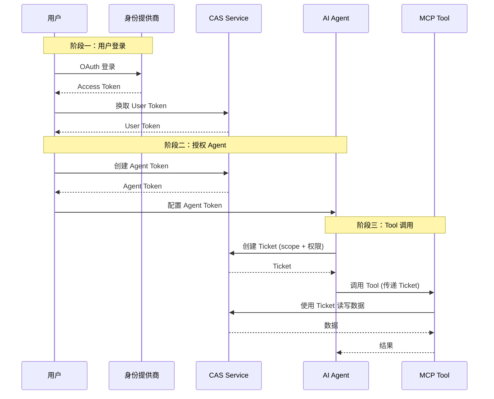
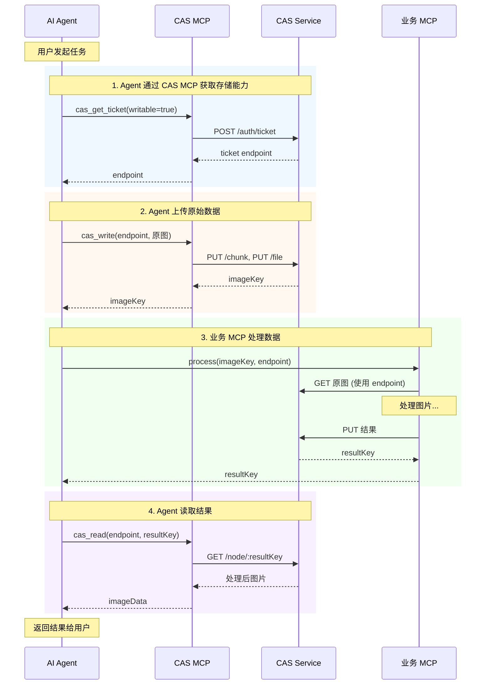

# CAS 技术原理：为 MCP 补上二进制数据的最后一块拼图

> 本文面向熟悉 MCP（Model Context Protocol）的开发者，介绍 CAS（Content-Addressable Storage）如何解决 MCP 协议中二进制数据处理的难题。

## 引言：MCP 的二进制数据困境

MCP 协议的核心是 `tools/call`——一个基于 JSON-RPC 的工具调用机制。这个设计简洁优雅，让 AI Agent 能够以统一的方式调用各种外部工具。但当我们试图让 Agent 处理图片、音频、视频等二进制数据时，问题就来了：
**JSON 天然不支持二进制**。

### 现有 workaround 的痛点

#### Base64 编码

最直接的方案是将二进制数据 base64 编码后塞进 JSON。这能工作，但代价不小：

- **体积膨胀 33%**：100MB 的文件变成 133MB
- **内存双倍占用**：编解码过程需要同时持有原始数据和编码结果
- **对 LLM 不友好**：大段 base64 字符串占用宝贵的 context window

#### 外部 URL（如 Presigned S3 URL）

另一个常见方案是返回一个临时 URL，让调用方自行下载。这解决了体积问题，但引入了新的麻烦：

- **生命周期管理**：URL 什么时候过期？谁负责清理？
- **认证复杂性**：URL 需要携带临时凭证，增加安全风险
- **一致性问题**：URL 指向的内容可能被修改或删除

更关键的是**数据归属问题**。按 MCP 协议的语义，`tools/call` 返回的数据应该归 Agent 所有——Agent 调用了工具，产出的结果理应由 Agent 掌控。但使用外部 URL 时，数据实际上被 MCP Tool 提供方管理和控制。

想象一个场景：Agent 调用图片处理工具生成了一张图，工具返回一个 S3 URL。三天后 Agent 想再次使用这张图，但 URL 已经过期，数据还在提供方的存储里，Agent 无法访问。这违背了「谁调用谁拥有」的直觉。

### 我们需要什么？

MCP 需要一个原生的二进制数据层，满足以下要求：

1. **所有权清晰**：blob 数据的所有权与 tool call 语义一致
2. **高效传输**：避免不必要的编解码和重复传输
3. **持久可靠**：数据不会意外丢失或过期
4. **安全可控**：细粒度的访问权限管理

CAS 正是为此而生。

---

## CAS 核心理念：内容即地址

CAS，全称 Content-Addressable Storage（内容寻址存储），是一种用数据内容的哈希值作为其地址的存储方式。

### 什么是内容寻址？

在传统文件系统中，我们用路径来定位文件：`/home/user/photo.jpg`。路径是人为指定的，与文件内容无关。同一个路径可以存放不同的内容，同一份内容也可以存在不同的路径。

内容寻址则完全不同：**数据的地址就是数据本身的指纹**。

```
内容: "Hello, World!"
SHA-256: 315f5bdb76d078c43b8ac0064e4a0164612b1fce77c869345bfc94c75894edd3
地址: sha256:315f5bdb76d078c43b8ac0064e4a0164612b1fce77c869345bfc94c75894edd3
```

这个简单的转变带来了三个重要特性：

#### 1. 不可变性

同一份内容永远对应同一个地址。如果内容有任何改动，哈希值就会完全不同。这意味着：

- **版本天然存在**：修改文件不会覆盖原版，而是产生新地址
- **引用永不失效**：一个 CAS key 永远指向同一份数据

#### 2. 全局去重

不同用户、不同工具、不同时间上传的相同内容，最终都指向同一个地址。存储系统只需保存一份副本。

```
用户 A 上传 logo.png → sha256:abc123
用户 B 上传相同的 logo.png → sha256:abc123（复用，无需重复存储）
```

#### 3. 完整性校验

地址本身就是校验和。从 CAS 读取数据后，重新计算哈希就能验证数据是否完整、是否被篡改。无需额外的校验机制。

### CAS 在业界的广泛应用

CAS 不是什么新概念，它已经在多个大规模系统中证明了自己的价值：

**Git**：每个 Git 仓库的 `.git/objects` 目录就是一个 CAS。blob（文件内容）、tree（目录结构）、commit（提交记录）都以 SHA-1 哈希作为文件名存储。
你可以用 `git hash-object` 命令亲自体验：

```bash
echo "Hello, World!" | git hash-object --stdin
# 输出: 8ab686eafeb1f44702738c8b0f24f2567c36da6d
```

**IPFS**：星际文件系统使用 CID（Content Identifier）作为内容地址，整个 P2P 网络形成一个全球去重的 CAS。任何人都可以通过 CID 获取内容，而无需知道内容存储在哪台机器上。

**Ethereum**：以太坊的世界状态使用 Merkle Patricia Trie 存储，每个节点的 key 是其内容的 Keccak-256 哈希。这确保了状态的完整性可以通过单个根哈希验证。

这些系统的成功运行证明：CAS 是大规模分布式存储的可靠选择。

---

## Merkle DAG：从 chunk 到 collection

仅有 CAS 的基本概念还不够。实际应用中，我们需要处理大文件、目录结构等复杂场景。CAS 系统采用三层节点结构来应对这些需求。

### 三层节点设计

| 层级 | 用途 | 设计考量 |
|------|------|----------|
| **chunk** | 原始二进制块 | 支持大文件分片、断点续传、流式处理 |
| **file** | 文件元数据 + chunk 引用 | 抽象「文件」概念，包含 contentType |
| **collection** | 目录结构 | 引用子节点，表达复杂数据结构 |

#### Chunk：最底层的数据块

chunk 是实际存储二进制数据的节点。每个 chunk 的大小有上限（默认 1MB），超过的数据会被分成多个 chunk。

```typescript
interface CasRawChunkNode {
  kind: "chunk";
  key: string;      // sha256:...
  size: number;
  parts?: string[]; // 如果 chunk 本身太大，可以进一步拆分
}
```

#### File：带元数据的文件

file 节点不直接存储内容，而是引用一个或多个 chunk，并携带元数据：

```typescript
interface CasRawFileNode {
  kind: "file";
  key: string;
  size: number;
  contentType: string;  // MIME type，如 "image/png"
  chunks: string[];     // chunk keys 列表
  chunkSizes: number[]; // 每个 chunk 的大小
}
```

这个设计让 `contentType` 成为文件的固有属性，读取时无需额外参数。

#### Collection：目录结构

collection 节点表示一个「目录」，其 children 是 name → key 的映射：

```typescript
interface CasRawCollectionNode {
  kind: "collection";
  key: string;
  size: number;
  children: Record<string, string>;  // 如 { "image.png": "sha256:...", "data.json": "sha256:..." }
}
```

### 为什么需要三层？

你可能会问：为什么不直接存文件内容，非要分成三层？

**大文件处理**：一个 10GB 的视频文件，如果作为单个 blob 存储，上传中断就要从头再来。分成 chunk 后，可以断点续传、并行上传。

**流式读取**：file 节点记录了每个 chunk 的大小，客户端可以实现 seek 操作，直接跳到视频的第 50 分钟，无需下载前面的内容。

**结构化输出**：Tool 经常需要返回多个相关文件（如处理后的图片 + 元数据 JSON），collection 让这变得自然。

### Merkle DAG 的完整性保证

这三层结构形成一个 Merkle DAG（有向无环图）。每个节点的 key 由其内容（包括它引用的子节点 key）计算得出。

```
collection (sha256:root)
├── image.png → file (sha256:f1)
│              └── chunk (sha256:c1), chunk (sha256:c2)
└── data.json → file (sha256:f2)
               └── chunk (sha256:c3)
```

只要根节点的 key 正确，就能保证整棵树的完整性：

1. 验证根节点内容的哈希等于 `sha256:root`
2. 递归验证每个子节点

任何节点被篡改，都会导致其 key 变化，进而导致父节点 key 变化，最终传递到根节点。这就是 Merkle 树的魔力。

---

## Ticket 机制：细粒度访问控制

CAS 解决了存储问题，但还有一个关键问题：**谁能访问这些数据？**

### 三层认证体系

CAS 采用三层认证设计：

```
用户登录（OAuth/Cognito）
         ↓
   User Token（长期，用户身份）
         ↓
   Agent Token（长期，代理身份）
         ↓
      Ticket（短期，单次操作）
```

下面的时序图展示了完整的认证流程：



#### 为什么需要三层？

**User Token**：绑定用户身份。用户登录后获得，可以执行所有操作，包括创建 Agent Token、管理数据等。但 User Token 不应该交给第三方工具。

**Agent Token**：给 MCP Server 使用。用户授权某个 AI Agent 访问自己的 CAS 存储后，Agent 获得一个长期有效的 Agent Token。Agent 可以用它创建 Ticket，但不能执行管理操作。

**Ticket**：临时访问凭证，给具体的 Tool 使用。遵循最小权限原则：

- **scope 限定**：只能访问指定的 DAG 根节点及其子节点
- **时效限定**：通常只有几分钟到一小时的有效期
- **操作限定**：可以是只读，或有限的写入权限

### Ticket 结构解析

```typescript
interface Ticket {
  pk: string;              // "ticket#{id}"
  type: "ticket";
  createdAt: number;
  expiresAt: number;
  issuerId: string;        // 签发者 ID
  realm: string;           // 用户命名空间（如 "usr_{userId}"）
  
  // 读权限：以这些 key 为根的 DAG 所有节点都可访问
  scope: string | string[];
  
  // 写权限配置
  writable?: boolean | {
    quota?: number;        // 字节数限制
    accept?: string[];     // 允许的 MIME types
  };
  
  // 写入结果（确保只写一次）
  written?: string;        // 已写入的 root key
  
  // Server 配置（Client 需遵守）
  config: {
    chunkThreshold: number;  // 分片阈值
  };
}
```

#### scope：权限边界

scope 定义了 Ticket 能访问的范围。如果 scope 是 `sha256:abc`，那么：

- 可以读取 `sha256:abc` 节点
- 如果它是 collection，可以读取其所有子节点（递归）
- 不能读取 scope 之外的任何节点

#### writable：写入控制

`writable` 字段控制写入权限：

- `false` 或不存在：只读 Ticket
- `true`：可写，无限制
- `{ quota: 10485760 }`：可写，但总大小不超过 10MB
- `{ accept: ["image/*"] }`：可写，但只接受图片类型

#### written：原子性保证

一个可写 Ticket 只能完成一次成功的写入。当写入成功时，`written` 字段记录最终的 root key。这个设计确保：

- **幂等性**：重复调用不会创建重复数据
- **原子性**：要么完整写入，要么完全回滚
- **可追溯**：通过 Ticket 可以追踪写入结果

### 安全设计思想

Ticket 机制的核心理念是**纵深防御**：

1. 即使 Ticket 泄露，攻击者只能访问 scope 内的数据
2. Ticket 很快过期，窗口期有限
3. 写入有配额和类型限制，无法滥用
4. 每次写入都有记录，便于审计

这比直接给 Tool 一个全能的 API Key 安全得多。

---

## MCP 集成：四方协作模型

理解了 CAS 的原理，现在来看它如何与 MCP 协议集成。

### 为什么需要 CAS MCP？

假设有一个图片处理 MCP（称为「业务 MCP」），它需要：

1. 读取用户上传的图片
2. 处理后写回结果

业务 MCP 返回的是 CAS key（如 `sha256:result123`），但 AI Agent 要读取这个 blob，就需要访问 CAS 服务的能力。

**关键洞察**：AI Agent 本身不直接集成 CAS SDK，而是通过配置一个 **CAS MCP** 来获得 CAS 访问能力。

这样设计的好处是：

- **Agent 保持通用性**：不需要为每个存储系统做适配
- **符合 MCP 范式**：CAS 能力以标准工具的形式暴露
- **配置灵活**：用户可以选择不同的 CAS 服务提供商

### 四方关系时序图

下图展示了四方在一次完整的图片处理任务中的交互：



#### 四方角色

- **AI Agent**：LLM，通过 MCP 协议调用工具，协调整个流程
- **MCP using CAS**：业务 MCP（如图片处理），依赖 CAS 存储 blob
- **CAS MCP**：Agent 配置的 MCP，提供 CAS 访问工具
- **CAS Service**：实际的存储服务，管理数据和权限

### CAS MCP 提供的工具

CAS MCP 暴露三个核心工具：

#### cas_get_ticket

获取访问票据。当 Agent 需要给业务 MCP 授权访问某些数据时使用。

```typescript
// 输入
{
  scope: "sha256:abc123",  // 或 ["sha256:a", "sha256:b"]
  writable: true,          // 是否需要写权限
  expiresIn: 300           // 有效期（秒）
}

// 输出
{
  endpoint: "https://cas.example.com/api/cas/usr_123/ticket/tkt_xyz",
  expiresAt: "2024-01-01T00:05:00Z",
  scope: "sha256:abc123"
}
```

#### cas_read

读取 blob 内容。

```typescript
// 输入
{
  endpoint: "https://...",  // 可选，不提供则用 Agent 默认存储
  key: "sha256:abc123",
  path: "."                 // 对于 collection，可以是 "./image.png"
}

// 输出
{
  content: "...",           // 文本内容或 base64
  contentType: "image/png",
  size: 12345
}
```

#### cas_write

写入 blob 内容。

```typescript
// 输入
{
  endpoint: "https://...",
  content: "...",
  contentType: "image/png",
  isBase64: true
}

// 输出
{
  key: "sha256:def456",
  size: 12345
}
```

### 工作流程要点

回顾上面的时序图，关键点如下：

1. Agent 先通过 CAS MCP 获取可写 Ticket
2. Agent 通过 CAS MCP 上传原始数据
3. Agent 调用业务 MCP，传递 CAS key 和 ticket endpoint
4. 业务 MCP 使用同一个 Ticket 读取输入、写入结果
5. Agent 通过 CAS MCP 读取处理结果

整个过程中，**数据始终在 Agent 的控制下**，业务 MCP 只有临时的、受限的访问权限。

---

## 设计取舍与思考

### 为什么选择 SHA-256？

CAS 使用 SHA-256 作为哈希算法，而不是：

- **SHA-1**：已被证明存在碰撞风险，Git 正在迁移到 SHA-256
- **SHA-3**：更新更安全，但性能略低，且生态系统支持不如 SHA-256
- **MD5**：碰撞攻击成熟，不适合安全场景

SHA-256 在安全性、性能、生态支持之间取得了良好平衡。

### 为什么 Ticket 而不是直接用 Agent Token？

Agent Token 是长期凭证，如果给每个 Tool 都用 Agent Token：

- Tool 可以访问 Agent 的所有数据
- Tool 可以创建无限的 Ticket
- Token 泄露影响范围大

Ticket 实现了最小权限原则：Tool 只能访问当前任务需要的数据，且很快过期。

### 与 IPFS 的异同

相似之处：

- 都是内容寻址
- 都支持 Merkle DAG
- 都有全局去重

不同之处：

- **网络模型**：IPFS 是 P2P 网络，CAS 是中心化服务
- **访问控制**：IPFS 公开可访问，CAS 有完整的权限系统
- **定位**：IPFS 是去中心化存储，CAS 是为 MCP 设计的 blob 层

CAS 不追求去中心化，而是专注于与 MCP 协议的深度集成和细粒度的权限控制。

### 与 Git 的异同

Git 的 objects 目录也是 CAS，但：

- Git 是本地存储，CAS 是网络服务
- Git 有 pack 文件优化，CAS 是纯 CAS
- Git 的 blob 没有 contentType，CAS 的 file 节点内置 contentType

CAS 借鉴了 Git 的核心理念，但针对网络化、多租户场景做了适配。

---

## 总结

CAS 为 MCP 协议补上了二进制数据处理的最后一块拼图。

### 解决的核心问题

1. **所有权归属**：blob 数据存储在 Agent 控制的空间，而非 Tool 提供方
2. **高效传输**：内容寻址天然去重，大文件分片流式处理
3. **安全可控**：Ticket 机制实现细粒度、时效性的访问控制

### 关键设计原则

- **内容寻址**：数据即地址，不可变、可校验、自动去重
- **分层认证**：User Token → Agent Token → Ticket，纵深防御
- **最小权限**：每个 Ticket 只授予必要的访问范围

### 后续学习路径

如果你想深入了解 CAS 的实现：

- 类型定义：`packages/cas-client-core/src/types.ts`
- 客户端实现：`packages/cas-client-core/src/client.ts`
- MCP 工具：`packages/casfa/backend/mcp-server.ts`
- 设计文档：`docs/CAS_BLOB_PLAN.md`

CAS 不是什么革命性的新发明——它站在 Git、IPFS、Ethereum 等前辈的肩膀上。但它为 MCP 生态量身定制，让 AI Agent 能够真正掌控自己处理的二进制数据。这是构建可靠、安全的 Agent 应用的重要基础。
